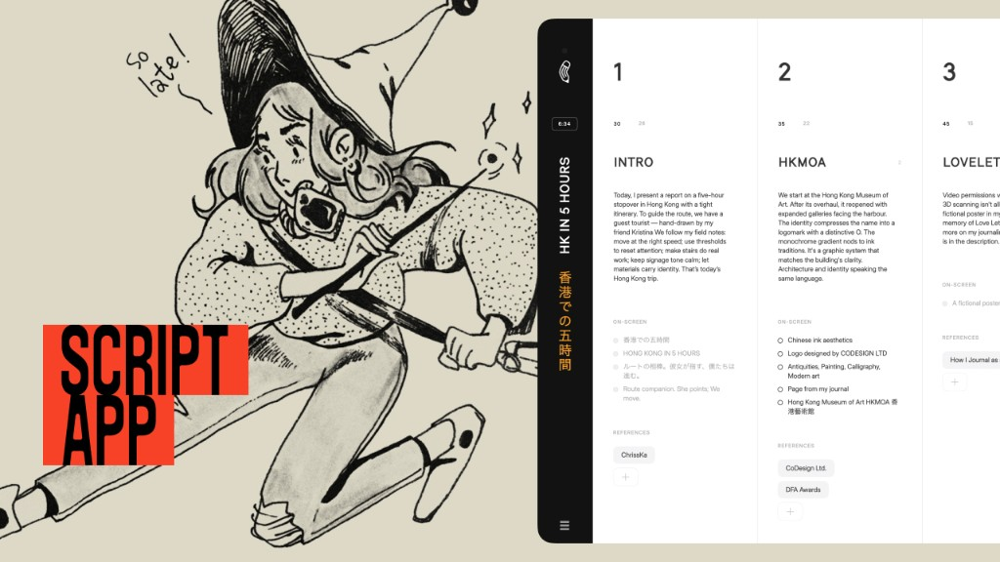

# SceneScript — Fork

This fork builds on [halfof8/script-app-oss](https://github.com/halfof8/script-app-oss) with significant UI/UX enhancements:

- **Full Dark Mode** — CSS variable theming with localStorage persistence, flash prevention, and smooth transitions throughout
- **Animated SVG Icon System** — Path-morphing icons (delete, drag, generate, etc.) with hover/active states
- **Undo System (Ctrl+Z)** — Global undo stack supporting scene CRUD, reorder, edits, and script changes
- **Version Browser** — Per-scene version history modal with arrow navigation
- **Canvas Drag Handle** — `devicePixelRatio`-aware dot grid with cursor-proximity opacity (replaces sub-pixel-prone CSS Grid dots)
- **Delete Animation** — Pure CSS red-curtain wipe + column collapse
- **Horizontal Scroll** — Mouse wheel and arrow-key navigation on storyboard
- **Locked Scenes** — Visual-only lock state (no overlay), yellow accent on hover
- **Toast System** — Animated slide-out notifications
- **Film Grain Overlay** — Perlin noise via offscreen canvas at ~24fps
- **Modal Dark Mode + Polish** — All modals themed, Escape key support, `useLayoutEffect` portal positioning
- **Plus other minor tweaks and polish.

Built with [opencode](https://opencode.ai) using a small local model to assist the development process.

---

# SceneScript

A local-first tool for writing video scripts scene by scene, with optional AI-assisted
narration generation through any OpenAI-compatible API.

[](https://youtu.be/5XqCRitYRC4)

▶︎ **[Watch the overview on YouTube](https://youtu.be/5XqCRitYRC4)** — a short tour of how the app works.

> ⚠️ **Status: unfinished personal playground.** I built this for myself, so expect rough edges.
> There is **no mobile version and no responsive layout** — it's designed for a wide desktop screen
> only. It is shared as-is, mostly as a reference and a fun thing to poke at, not as a polished product.

## Try the demo

The fastest way to learn the app is the built-in **onboarding demo**. From an empty project, click
**Load onboarding demo**: it loads a sample script whose scenes double as a guided tour, walking you
through scenes, durations, drafts, narration, on-screen text, references, versions, locking, and
settings. Clear it whenever you're ready to start your own.

SceneScript organizes a video into a horizontal storyboard of scene columns. Each scene
holds a duration, draft notes, on-screen text, and reference links. You can generate spoken
narration per scene (or in batch) that respects a target word count derived from the scene
duration and a configurable speaking pace, then export everything — including a generated
YouTube description — when you're done.

All data is stored locally in your browser via IndexedDB. No backend is required.

## Features

- Scene-based storyboard with drag-to-reorder, insert, and delete
- Per-scene draft versions and narration versions
- AI narration generation targeting a word count based on duration × pace
- Timeline and reading layout modes
- On-screen text checklist and reference links per scene
- YouTube description generator
- Import / export of all data as JSON
- Bring-your-own-key: works with any OpenAI-compatible `chat/completions` endpoint

## Getting started

```bash
npm install
npm run dev
```

Then open the printed local URL. Click **Load onboarding demo** to populate a sample script
that walks you through every feature, or start from an empty project.

## Configuration

Open **Settings** to set:

- **API Base URL** — defaults to `https://api.openai.com/v1`. Any OpenAI-compatible endpoint works.
- **API Key** — stored locally in your browser only.
- **Model** — e.g. `gpt-4o`, `gpt-4.1`, etc.
- **Pace** — words per second, used to compute per-scene target word counts.

During development, requests are routed through a small dev-server proxy
(`/llm-proxy`, see `vite.config.ts`) to avoid browser CORS restrictions. The proxy simply
forwards the request to the base URL you configured, attaching your key as a Bearer token.

## Scripts

- `npm run dev` — start the Vite dev server
- `npm run build` — type-check and build for production
- `npm run preview` — preview the production build
- `npm run lint` — run ESLint

## Tech stack

React 19, TypeScript, Vite, Tailwind CSS, Zustand, Dexie (IndexedDB), dnd-kit.

## License

See [LICENSE](./LICENSE).
